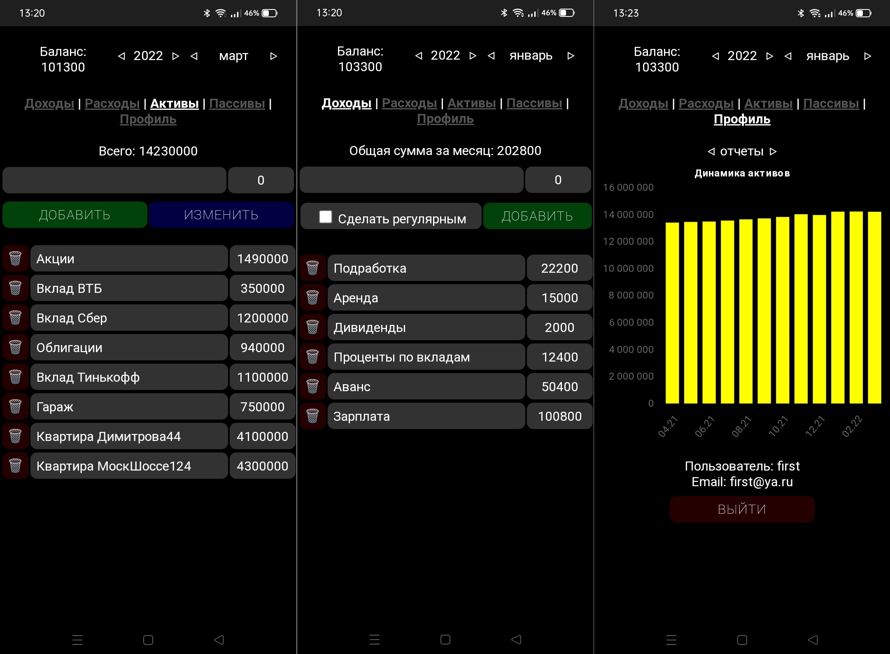
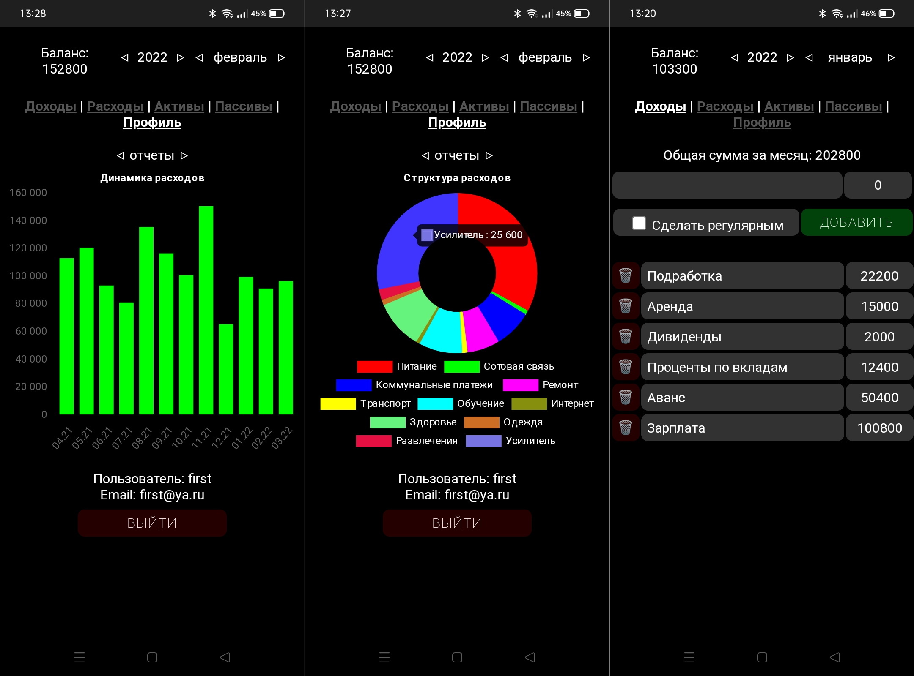
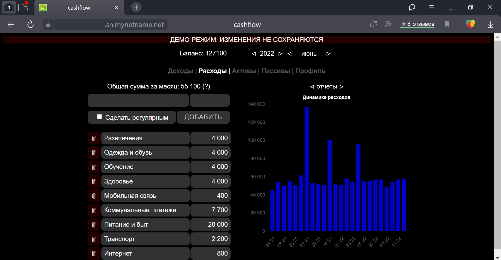

# CashFlowUI

Frontend дл€ сервиса CashFlow ("ƒенежный поток").

»спользуетс€ Vue3/Vuex/Vue-router/Chart.js.

Backend здесь https://github.com/darkavengersmr/CashFlow

–еализованы:
- регистраци€ и авторизаци€
- ведение доходов и расходов, с возможностью делать их регул€рными
- ведение активов и пассивов с фиксацией их стоимости за период
- возможность ввода, корректировки, удалени€ позиций
- отчеты по динамике и структуре в разрезе каждой из категорий

